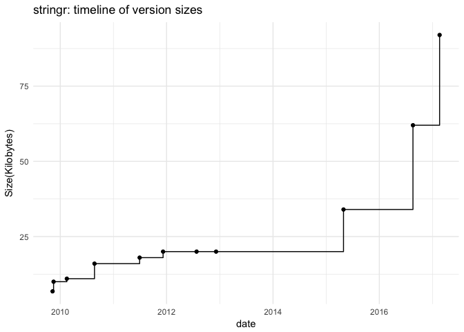
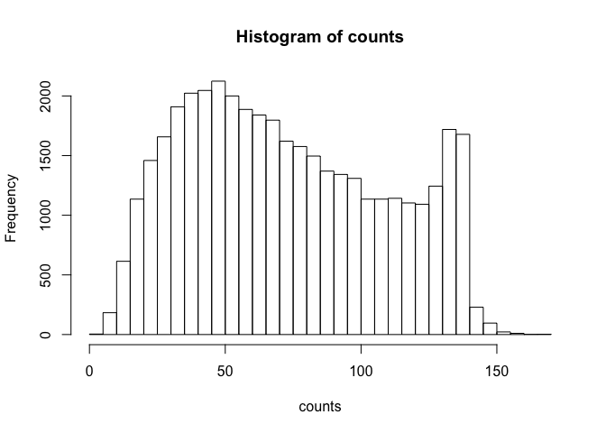
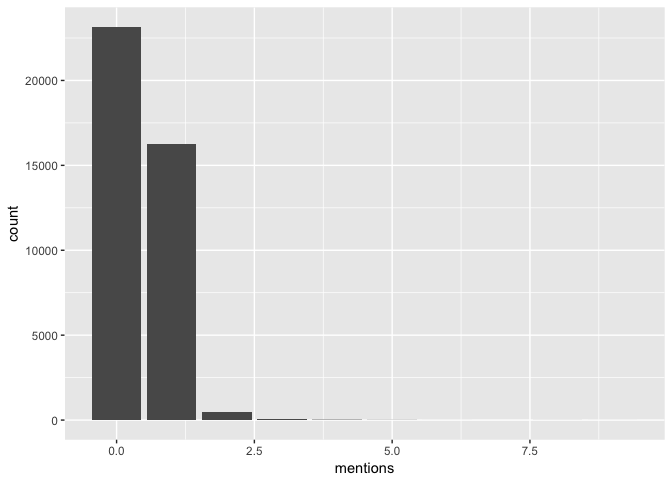

Homework 4
================
Phoebe Abramowitz
4/11/2018

### Question 1.4

``` r
library(dplyr)
```

    ## 
    ## Attaching package: 'dplyr'

    ## The following objects are masked from 'package:stats':
    ## 
    ##     filter, lag

    ## The following objects are masked from 'package:base':
    ## 
    ##     intersect, setdiff, setequal, union

``` r
library(ggplot2)
library(stringr)

source('../code/archive-functions.R')
raw_data <- read_archive('stringr')
clean_data <- clean_archive(raw_data)
plot_archive(clean_data)
```



``` r
write.csv(clean_data,file = "../data/stringr-archive.csv")
```

### Question 1.5

``` r
raw_data2 <- read_archive('ggplot2')
clean_data2 <- clean_archive(raw_data2)

raw_data3 <- read_archive('XML')
clean_data3 <- clean_archive(raw_data3)

raw_data4 <- read_archive('knitr')
clean_data4 <- clean_archive(raw_data4)

raw_data5 <- read_archive('dplyr')
clean_data5 <- clean_archive(raw_data5)

write.csv(clean_data2,file = "../data/ggplot2-archive.csv")
write.csv(clean_data3,file = "../data/xml-archive.csv")
write.csv(clean_data4,file = "../data/knitr-archive.csv")
write.csv(clean_data5,file = "../data/dplyr-archive.csv")
```

``` r
comb_data <- bind_rows(clean_data2,clean_data3,clean_data4,clean_data5)

ggplot(data=comb_data, aes(x=date,y=size,color=name))+
  geom_step()+
  ylab("Size(Kilobytes)")+
  xlab("Date")+
  theme_minimal()
```


``` r
ggplot(data=comb_data,aes(x=date,y=size,color=name))+
  facet_wrap(~name,scales="free")+
  geom_step(aes(group=1))+
  ylab("Size(Kilobytes)")+
  xlab("Date")+
  theme_minimal()
```

 \#\#Question 3

``` r
text_emotion <- read.csv(url('https://raw.githubusercontent.com/ucb-stat133/stat133-spring-2018/master/data/text-emotion.csv'))
head(text_emotion)
```

    ##     tweet_id  sentiment        author
    ## 1 1956967341      empty    xoshayzers
    ## 2 1956967666    sadness     wannamama
    ## 3 1956967696    sadness     coolfunky
    ## 4 1956967789 enthusiasm   czareaquino
    ## 5 1956968416    neutral     xkilljoyx
    ## 6 1956968477      worry xxxPEACHESxxx
    ##                                                                                        content
    ## 1 @tiffanylue i know  i was listenin to bad habit earlier and i started freakin at his part =[
    ## 2                                 Layin n bed with a headache  ughhhh...waitin on your call...
    ## 3                                                          Funeral ceremony...gloomy friday...
    ## 4                                                         wants to hang out with friends SOON!
    ## 5       @dannycastillo We want to trade with someone who has Houston tickets, but no one will.
    ## 6         Re-pinging @ghostridah14: why didn't you go to prom? BC my bf didn't like my friends

``` r
contents <- text_emotion$content
```

``` r
l <- length(contents)
counts <- rep(0,l)
for(i in 1:l){
  counts[i] <- str_length(contents[i])
}
summary(counts)
```

    ##    Min. 1st Qu.  Median    Mean 3rd Qu.    Max. 
    ##    1.00   43.00   69.00   73.41  103.00  167.00

``` r
hist(counts,breaks=30)
```

 \#\#3.2 Number of mentions

``` r
#count the number of @ mentions in the tweet contents
#input of each tweet contents in a character string
source('../code/regex-functions.R')
#write mention_cntr function 
#Could use split_chars and iterate with if statements
#could use str_split and hit the after @ stuff\
#account for capitals
not_num<- function(x){
  if(x=="1"|x=="2"|x=="3"|x=="4"|x=="5"|x=="6"|x=="7"|
     x=="8"|x=="9"){
    FALSE
  }
  else{
    TRUE
  }
}

#This could be shorter but idk the functions
not_alpha <- function(x){
  if(x=="a"|x=="b"|x=="c"|x=="d"|x=="e"|x=="f"|x=="g"|
     x=="h"|x=="i"|x=="j"|x=="k"|x=="l"|x=="m"|x=="n"|
     x=="o"|x=="p"|x=="q"|x=="r"|x=="s"|x=="t"|x=="u"|
     x=="v"|x=="w"|x=="x"|x=="y"|x=="z"|
     x=="A"|x=="B"|x=="C"|x=="D"|x=="E"|x=="F"|x=="G"|
     x=="H"|x=="I"|x=="J"|x=="K"|x=="L"|x=="M"|x=="N"|
     x=="O"|x=="P"|x=="Q"|x=="R"|x=="S"|x=="T"|x=="U"|
     x=="V"|x=="W"|x=="X"|x=="Y"|x=="Z"){
    FALSE
  }
  else{
    TRUE
  }
}

valid_chars <- function(string){
  valid <- TRUE
  for(i in 2:str_length(string)){
    char_i <- str_sub(string,start=i,end=i)
    if(not_alpha(char_i) & not_num(char_i) & char_i!="_" ){
      valid <- FALSE
    }
  }
  valid
}

mention_cntr <- function(tweet){
  m_count <- 0
  words <- strsplit(tweet," ")[[1]]
  l <- length(words)
  v <- rep(0,l)
  for (i in 1:l){
    if (str_sub(words[i],1,1)=="@"& str_length(words[i])<16&valid_chars(words[i])){
      m_count <- m_count +1
    }
  }
  m_count
}


c <- length(contents)
mentions <- rep(0,c)
for(i in 1:c){
  mentions[i] <- mention_cntr(as.character(contents[i]))
}
head(mentions)
```

    ## [1] 1 0 0 0 1 0

``` r
m_tab <- table(mentions)
m_tab
```

    ## mentions
    ##     0     1     2     3     4     5     6     8     9 
    ## 23150 16263   481    70    22     9     1     3     1

``` r
ggplot(data=as.data.frame(mentions))+
  geom_bar(aes(x=mentions))
```



``` r
##Tweet with 10 mentions
contents[mention_cntr(as.character(contents))==10]
```

    ## factor(0)
    ## 39827 Levels: - arrggh kids that won't settle....need some Kava for Liam, that'll sort 'em... ...
